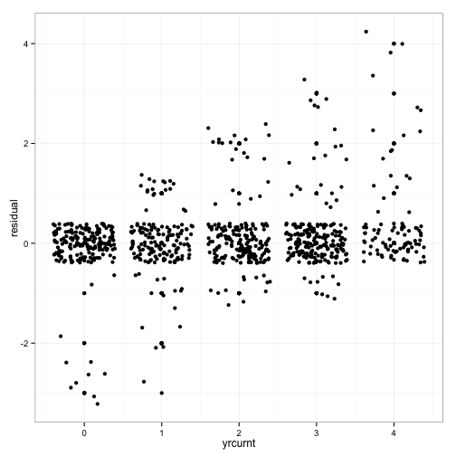

Corrected Election Timing Variable (yrcurnt)
=================

Christopher Gandrud

24 September 2014

Corrects errors and inconsistencies in the
[Database of Political Institution's](http://go.worldbank.org/2EAGGLRZ40) (2012)
years to election (**yrcurnt**) variable.

The corrected variable is called **yrcurnt_corrected**. It is currently updated
only for EU 27 countries.

## Motivation

The **yrcurnt** election timing variable is a regularly used measure of government
election timing. For example, [Alt et al. (2014)](http://dx.doi.org/10.1017/S0007123414000064)
use the variable in their recent study of fiscal gimmickry in Europe. They find
that fiscal gimmickry is more common directly before elections (and in countries
with weak fiscal transparency).

Because the variable is so regularly turned to for testing how election timing affects
governments' choices, it is especially important that it be reliable and valid.
However, the variable in the current (2012) release has a number of issues that
this repository hopes to correct.

Note that Alt et al.'s substantive findings hole up when using the correct data,
thought the estimated magnitudes of the effects are reduced somewhat.

### Variable definition

The
[2012 codebook](http://siteresources.worldbank.org/INTRES/Resources/469232-1107449512766/DPI2012_Codebook2.pdf)
classifies the **yrcurnt** variable as the years left in the chief
executive's current term such that:

> ''a '0' is scored in an election year, and n-1 in the year after an election, where n is the length of the term. In countries where early elections can be called, YRCURNT is set to the de jure term limit or schedule of elections, but resets in the case of early elections.''

### Issues in the 2012 data

The original variable has a number of issues that make it problematic for studying
the effect of election timing on government policymaking. Primarily:

#### Validity concerns

- For a number of countries (e.g. Austria) the elections recorded are for a largely
figurehead president. This can affect both when election is recorded and how many
years until the next election as figurehead presidents often have longer terms than
parliaments. In these cases the current **yrcurnt** variable is not
a valid measure of *government* election timing.

- Some countries are less clear cut in that they are semi-presidential. Nonetheless,
in a number of these cases (e.g. Romania), however, the PM is the clear leader of the government
and the domestic policy agenda. These powers are most relevant for studying things
like public budgeting.

#### Reliability concerns

- There are many instances where election years are not recorded as 0, as the
coding scheme defines.

## Updated Data

A corrected version of the variable for EU 27 countries can be found in
[data/yrcurnt_corrected.csv](data/yrcurnt_corrected.csv). This includes only updated
observations. A data file with both full
the original and corrected data can be found in [data/yrcurnt_original_corrected.csv](data/yrcurnt_original_corrected.csv).

Election timing data from 1990 to the present was found at the
[European Election Database](http://www.nsd.uib.no/european_election_database/)
These election dates were corroborated with data from Wikipedia. Election dates from
before 1990 are also from Wikipedia.

The full list of changes are given in the following table.

### Change List

| Country | Changes                                                            |
| ------- | ------------------------------------------------------------------ |
| Austria | Use parliamentary rather than (figurehead) presidential elections. |
| Belgium | Corrects missing 2010 election year.                               |
| Denmark | Corrects missing 2001 and 2007 elections.                          |
| Estonia | Corrects 1995, 1999, 2003, 2007, and 2011 elections. Also counting originally started at 4, but should start at 3 as there is a 4 year term limit (not 5). |
| Germany | Corrects missing 2005 election.                                    |
| Greece  | Corrects missing 2007, 2009, 2012 election years.                  |
| Ireland | Corrects missing 2011 election.                                    |
| Italy   | Corrects missing 2008 election.                                    |
| Lithuania | Use parliamentary rather than presidential elections. It is a semi-presidential system where the president appoints the PM, the legislature's approval is needed. PM is more responsible for domestic policy. |
| Latvia  | Corrects missing 2006, 2010, 2011 election years.                  |
| Netherlands | Corrects missing 2003 and 2006 elections.                      |
| Portugal | Corrects missing 1979, 1999, and 2011 elections.                  |
| Romania | Semi-presidential where the president appoints the PM, but they must be approved by the parliament and the PM is both head of government and sets the legislative agenda. Before 2008 presidential and parliamentary elections had happened in the same year. |
| Slovenia | Use parliamentary rather than (figurehead) presidential elections.|
| Slovakia | Corrects missing 2012 election.                                   |
| Spain   | Corrects missing 1989, 1996, and 2011 elections.                   |
| United Kingdom | Corrected missing 2001 and 2005 elections.                  |

## Overview of changes

17 of the 27 countries required some corrections. The bulk of these corrections
were in the post-2000 period. Many countries are simply missing elections in
the 2000s period.

The following figure plots the original **yrcurnt** value compared to the
residual of the original and corrected values (e.g. original - corrected). The points
are jittered to make them easier to see. A residual of 0 clearly indicates 
that an observation was not corrected.

 
